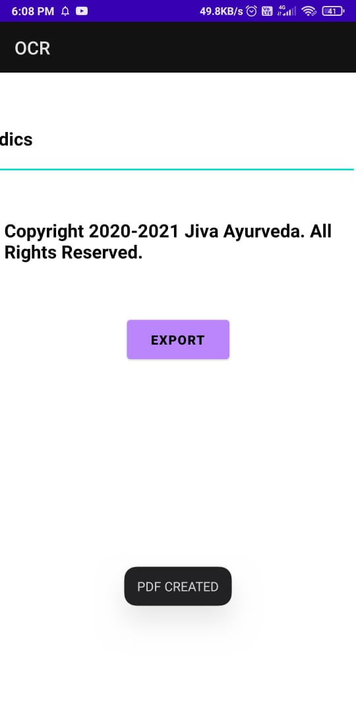

# OCR
This is one type Converter in this android app you can extract image contain text using camera and gallery and it will display text and you can save the text in pdf form and share it and it will perform text to speech also, In this app we used Google ML KIt and FIREBASE libraries.
# Screenshot
Light Mode:-

